# myPage
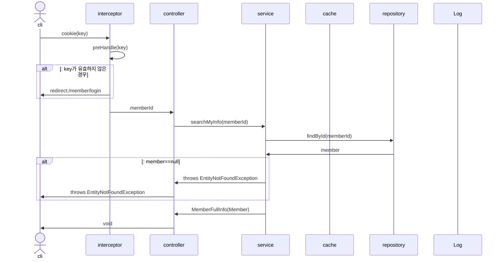

# UnfollowMember
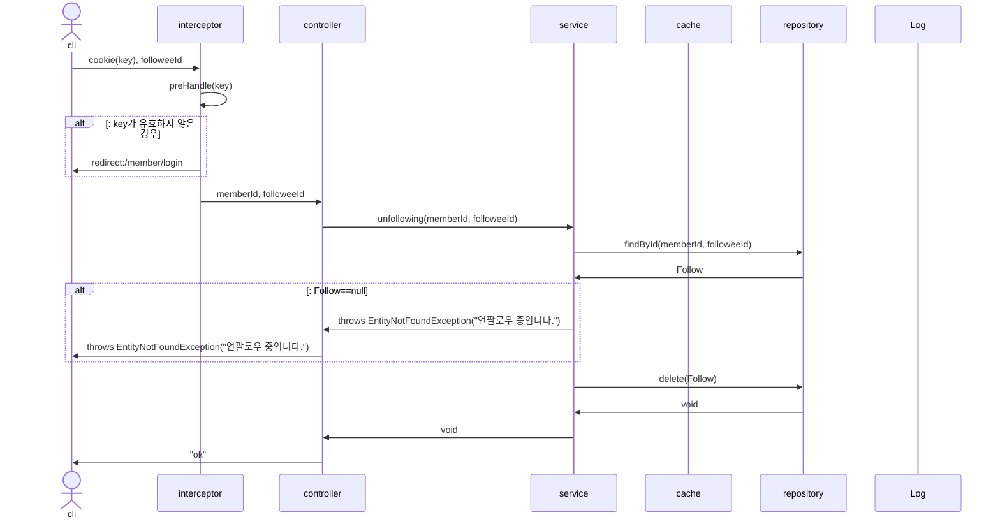

# FollowMember
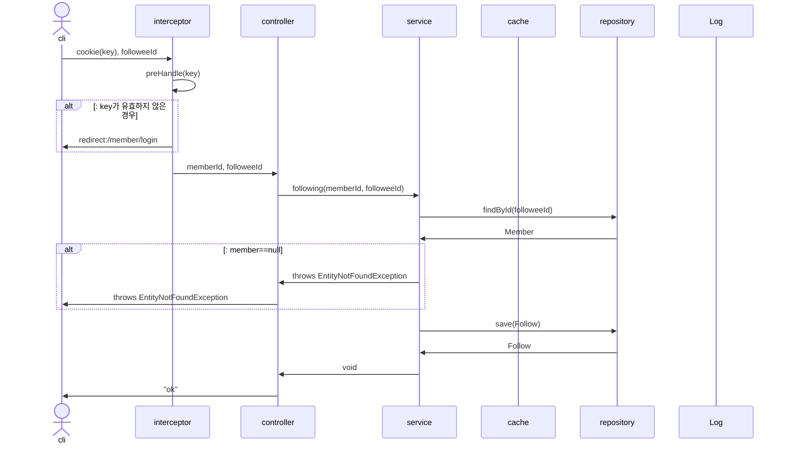

# LoginCheckInterceptor

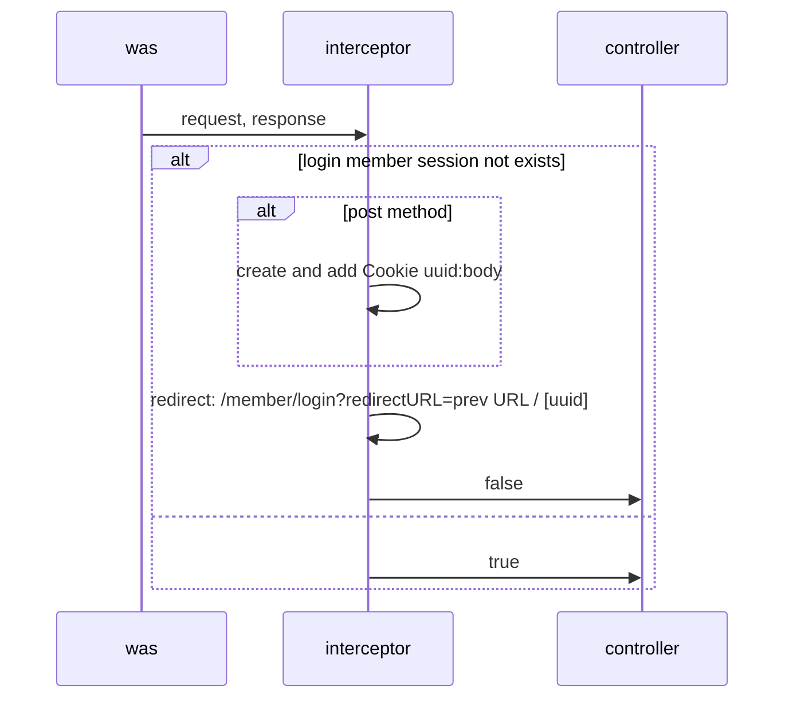

# occupyMemberEmail


# occupyMemberNickName

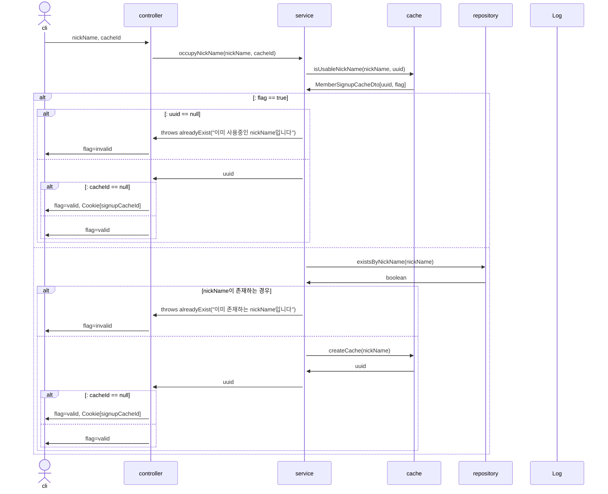

# memberSignupForm
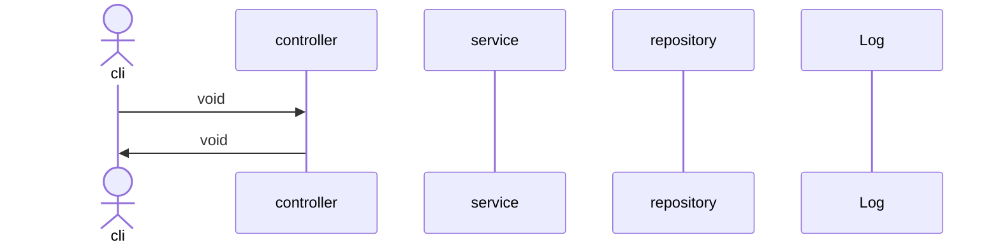

# memberSignup

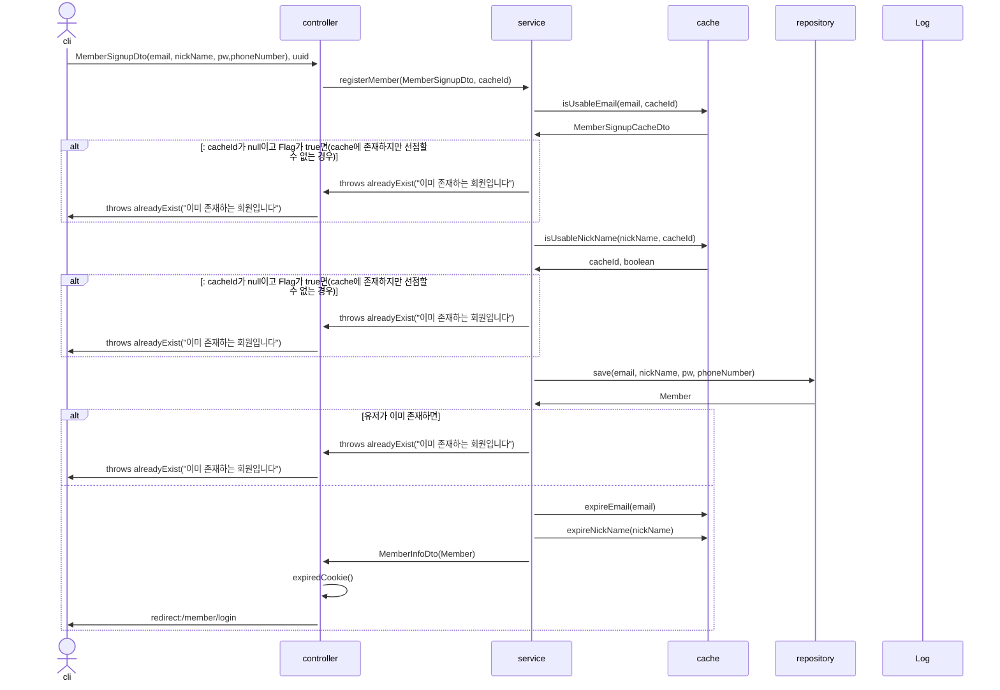

# withdrawForm
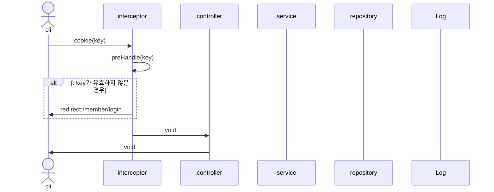

# withdraw
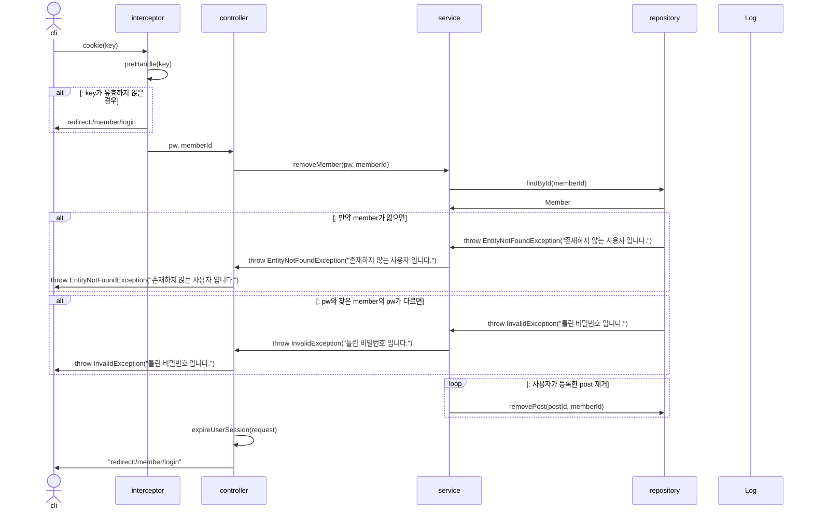

# isValidPwForm


# modifyMemberForm
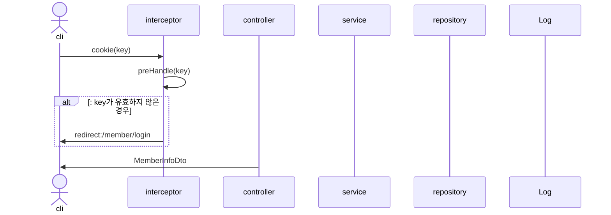

# modifyMember

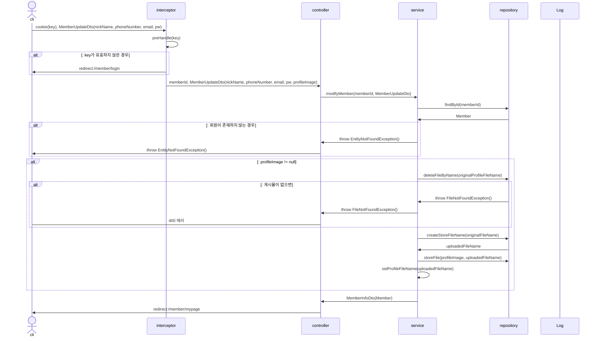

# login
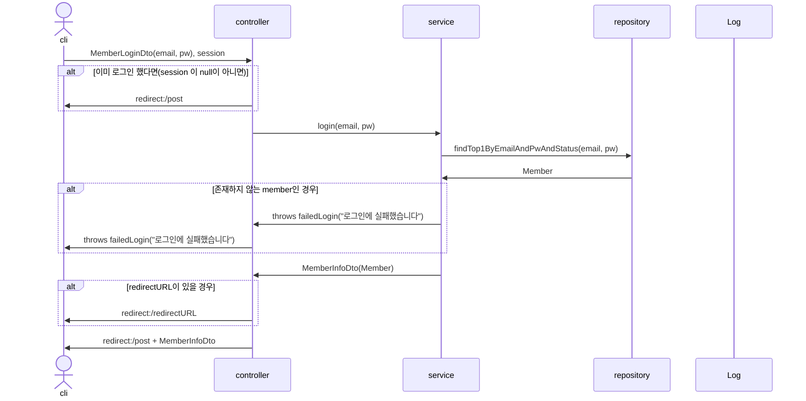

# logout


# searchLostMemberEmailForm


# searchLostMemberEmail
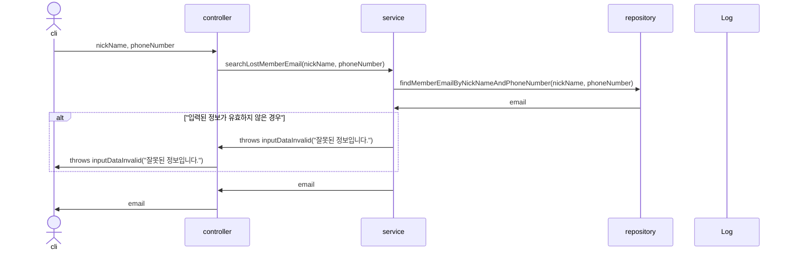

# searchLostMemberPwForm


# searchMemberPageForm
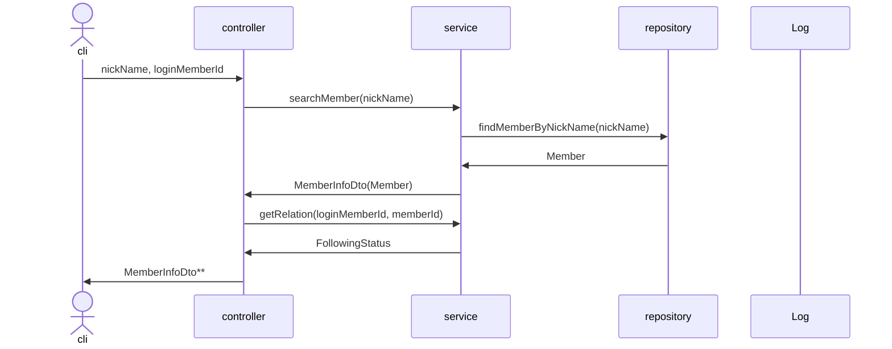

# searchMemberPage
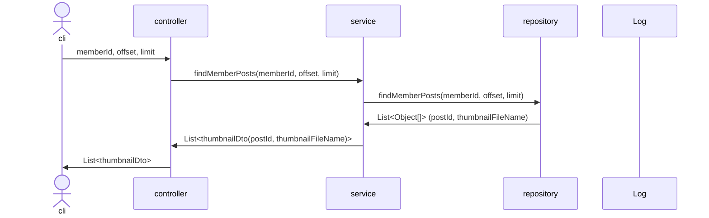

# savePost
```mermaid
sequenceDiagram
actor cli
participant i as interceptor
participant c as controller
participant s as service
participant hashTagService
participant r as repository
participant l as Log

cli->>i: cookie(key), PostSaveDto(글, 이미지)
i->>i: preHandle(key)
alt: key가 유효하지 않은 경우
i->>cli: redirect:/member/login
end
i->>c: memberId, PostSaveDto(글, 이미지)
c->>c: setMemberId(memberId)
c->>+s: uploadPost(PostSaveDto)
s->>s: checkImageSize(이미지)
alt 이미지 사이즈가 규격외라면
s->>c: throw outOfSize()
c->>cli: "이미지 업로드 용량을 초과했습니다"
end
loop: uploadedFileName을 가진 Image 객체 List 생성
s->>r: createStoreFileName(originalFileName)
r->>s: uploadedFileName
end
s->>r: storeFiles(List<MultipartFile>, List<Image>)
alt: 이미지 저장에 실패하면
r->>s: throw failImgSave();
s->>c: throw failImgSave();
c->>cli: throw failImgSave();
end
r->>s: void
s->>r: getById(memberId)
r->>s: Member
s->>hashTagService: storePostHashTags(Post)
alt if numOfPostHashTag > 0
hashTagService->>r: deleteByPostId(postId)
end
hashTagService->>hashTagService: parsingHashTag(postContent)
hashTagService->>hashTagService: getHashTagList(Set<String> hashTagName)
loop foundHashTag exist
hashTagService->>r: save(postHashTag) 
hashTagService->>s: List<PostHashTag>
end
s->>r: save(Post(글, 작성자, List<파일 경로>, List<태그>))
loop: List
s->>s: img.setPost(post)
s->>r: save(img)
end
s->>l: upload 성공
s->>c: postId
c->>cli: "redirect:/post/" + postId
```

# delete post
```mermaid
sequenceDiagram
actor cli
participant i as interceptor
participant c as controller
participant s as service
participant r as repository
participant l as Log

cli->>i: cookie(key), postId
i->>i: preHandle(key)
alt: key가 유효하지 않은 경우
i->>cli: redirect:/member/login
end
i->>c: postId, memberId
c->>s: removePost(postId, memberId)
s->>r: findById(postId)
alt 게시물이 없으면
r->>s: throw EntityNotFoundException()
s->>c: throw EntityNotFoundException()
c->cli: 400 에러
end
s->>s: havePermission(memberId, uploaderId)
alt 권한이 없으면
s->>c: throw InvalidException
c->>cli: throw InvalidException
end
s->>r: deleteFiles(image)
alt 게시물이 없으면
r->>s: throw FileNotFoundException()
s->>c: throw FileNotFoundException()
c->cli: 400 에러
end
s->>r: delete(foundPost)
s->>c: void
c->>cli: void
```

# updatePostForm

```mermaid
sequenceDiagram
actor cli
participant i as interceptor
participant c as controller
participant s as service
participant r as repository
participant l as Log

cli->>i: cookie(key), postId
i->>i: preHandle(key)
alt: key가 유효하지 않은 경우
i->>cli: redirect:/member/login
end
i->>c: postId
c->>s: getPost(postId)
s->>r: findById(postId)
alt 없는 post를 수정 요청하면
r->>s: throw EntityNotFoundException()
s->>c: throw EntityNotFoundException()
c->cli: 400 에러
end
r->>s: Post(images, content, author, dateTime)
s->>c: PostResponseDto(Post)
c->>cli: PostResponseDto
```

# updatePost

```mermaid
sequenceDiagram
actor cli
participant i as interceptor
participant c as controller
participant s as service
participant hashTagService
participant r as repository
participant l as Log

cli->>i: cookie(key), PostUpdateDto(pk, prevContent, postContent)
i->>i: preHandle(key)
alt: key가 유효하지 않은 경우
i->>cli: redirect:/member/login
end
i->>c: PostUpdateDto
c->>s: modifyPost(PostUpdateDto)
s->>r: findById(postId)
alt 없는 post를 조회 요청하면
r->>s: throw EntityNotFoundException()
s->>c: throw EntityNotFoundException()
c->cli: throw EntityNotFoundException()
end
s->>hashTagService: storePostHashTags(prev)
alt if numOfPostHashTag > 0
hashTagService->>r: deleteByPostId(postId)
end
hashTagService->>hashTagService: parsingHashTag(postContent)
hashTagService->>hashTagService: getHashTagList(Set<String> hashTagName)
loop foundHashTag exist
hashTagService->>r: save(postHashTag) 
end
hashTagService->>s: List<PostHashTag>
s->>c: postId
c->>cli: redirect:/post/postId
```

# saveComment

```mermaid
sequenceDiagram
actor cli
participant i as interceptor
participant c as controller
participant s as service
participant r as repository
participant l as Log

cli->>i: cookie(key), postId, CommentRequestDto(content)
i->>i: preHandle(key)
alt: key가 유효하지 않은 경우
i->>cli: redirect:/member/login , uuid-body 쿠키 생성
end
i->>c: memberId, postId, CommentRequestDto
c->>s: addComment(postId, memberId, CommentRequestDto)
s->>r: findPostById(postId)
alt 게시물이 없으면
r->>s: throw EntityNotFoundException()
s->>c: throw EntityNotFoundException()
c->cli: 400 에러
end
r->>s: Post
s->>r: findMemberById(memberId)
alt 게시물이 없으면
r->>s: throw EntityNotFoundException()
s->>c: throw EntityNotFoundException()
c->cli: 400 에러
end
r->>s: Member
s->>r: save(Comment)
r->>s: void
s->>c: void
c->>cli: void
```

# removeComment

```mermaid
sequenceDiagram
actor cli
participant i as interceptor
participant c as controller
participant s as service
participant r as repository
participant l as Log

cli->>i: cookie(key), postId, commentId
i->>i: preHandle(key)
alt: key가 유효하지 않은 경우
i->>cli: redirect:/member/login
end
i->>c: postId, commentId, memberId
c->>s: removeComment(postId, commentId, memberId)
s->>r: findPostById(postId)
alt 게시물이 없으면
r->>s: throw EntityNotFoundException()
end
s->>r: findCommentById(commentId)
alt 댓글 없으면
r->>s: throw EntityNotFoundException()
end
s->>s: havePermission(memberId, commenterId)
alt 권한이 없으면
r->>s: throw InvalidException()
end
s->>c: throw EntityNotFoundException(), 
c->cli: 400 에러
end
s->>r: delete(commentId)
r->>s: void
s->>c: void
c->>cli: void
```

# searchByTagForm
```mermaid
sequenceDiagram
actor cli
participant c as controller
participant s as service
participant r as repository
participant l as Log

cli->>c: tagName
c->>s: getTagByTagName("#" + tagName)
s->>r: findByName(tagName)
r->>s: HashTag
alt: tag가 존재하지 않으면
s->>c: throw EntityNotFoundException()
c->>cli : throws EntityNotFoundException()
end
s->>c: TagResponseDto(HashTag)
c->>cli: TagResponseDto
```


# searchByTag

```mermaid
sequenceDiagram
actor cli
participant c as controller
participant s as service
participant r as repository
participant l as Log

cli->>c: tagId, cursor, limit
c->>s: getTagPosts(tagId, cursor, limit)
s->>r: findPostIdAndThumbnailFileNameByTagId(tagId, cursor, limit)
r->>s: List<Object[]>
s->>c: List<ThumbnailDto(post_id, thumbnailFileName)>
c->>cli: List<ThumbnailDto>

```

# showPostForm
```mermaid
sequenceDiagram
actor op
participant c as controller
participant s as service
participant r as repository
participant l as Log

op->>c: postId
c->>s: getPost(postId)
s->>r: findById(postId)
alt: Post가 없으면
r->>s: throw EntityNotFoundException()
s->>c: throw EntityNotFoundException()
c->>op: throw EntityNotFoundException()
end
r->>s: Post
s->>c: postResponseDto(Post)
c->>op: PostResponseDto
```

# showFeed
```mermaid
sequenceDiagram
actor cli
participant c as controller
participant s as service
participant r as repository
participant l as Log
# 매번 새로운 것을 보여줘야함
cli->>c: cursor,limit
c->>s: showPosts(cursor, limit)
alt: feed 조회가 처음인 경우
s->>r: findFirstFollowingPosts(limit)
else:
s->>r: findFollowingPosts(cursor, limit)
end
r->>s: List<Post>
s->>c: List<ThumbnailDto(postId, thumbnailFileName)>
c->>cli: List<ThumbnailDto>
```

# showFeedForm
```mermaid
sequenceDiagram
actor cli
participant c as controller
participant s as service
participant r as repository
participant l as Log

cli->>c: void
c->>cli: void
```

# deleteMember(현재 active status를 이용하기 때문에 사용 안함)

```mermaid
sequenceDiagram
actor cli
participant i as interceptor
participant c as controller
participant s as service
participant r as repository
participant l as Log

cli->>i: cookie(key)
i->>i: preHandle(key)
alt: key가 유효하지 않은 경우
i->>cli: redirect:/member/login
end
i->>c: memberId, pw
c->>s: removeMember(memberId, pw)
s->>r: findById(memberId)
r->>s: Member
alt member가 없는 경우
s->>c: throws EntityNotFoundException("존재하지 않는 사용자 입니다.")
c->>cli: throws EntityNotFoundException("존재하지 않는 사용자 입니다.")
end
alt 유효하지 않은 비밀번호인 경우
s->>c: throws inValidException("틀린 비밀번호 입니다.")
c->>cli: throws inValidException("틀린 비밀번호 입니다.")
end
s->>r: member.setStatus(INACTIVE)
loop posts:
s->>s: removePost(postId)
end
s->>c: void
c->>c: expire(cookie)
c->>cli: void
```

# isValidPw(기능 수정 필요)
```mermaid
sequenceDiagram
actor cli
participant i as interceptor
participant c as controller
participant s as service
participant r as repository
participant l as Log

cli->>i: cookie(key), pw
i->>i: preHandle(key)
alt: key가 유효하지 않은 경우
i->>cli: redirect:/member/login
end
i->>c: memberId, pw
c->>s: isValidPw(memberId, pw)
s->>r: findMemberByIdAndPw(memberId, pw)
r->>s: Member
alt: pw가 유효하지 않은 경우
s->>c: throw EntityNotFoundException()
c->>cli: throw EntityNotFoundException()
end
s->>c: MemberFullInfoDto(Member)
alt: 멤버가 존재하지 않으면
c->>cli : "redirect:/member/verify";
end
c->>cli: MemberFullInfoDto
```

# searchLostMemberPw(기능추가 필요)
```mermaid
sequenceDiagram
actor cli
participant c as controller
participant s as service
participant r as repository
participant l as Log

cli->>c: email
c->>s: searchLostMemberPw(email)
s->>r: findMemberByEmail(email)
r->>s: Member
s->>s: createTemporalPw()
s->>r: sendTemporalPwToEmail(email, temporalPw)
s->>r: setPw(temporalPw)
s->>c: void
c->>cli: redirection:/member/login
```

<!-- 부적절하다는 요청 -->
# hide post(보류)
```mermaid
sequenceDiagram
actor op
participant c as controller
participant s as service
participant r as repository
participant l as Log

op->>c: postId
c->>s: hidePost(postId)
s->>r: findById(postId)
r->>r: activePost(invisible)
r->>s: postId
```

# restore post(보류)
```mermaid
sequenceDiagram
actor op
participant c as controller
participant s as service
participant r as repository
participant l as Log

op->>c: postId
c->>s: hidePost(postId)
s->>r: findById(postId)
r->>r: changeStatus(invisible)
r->>s: postId
```

# Remove Post(backup 넣은 경우)

```mermaid
sequenceDiagram
actor cli
participant c as controller
participant s as service
participant r as repository
participant l as Log

cli->>c: cookie(key), postId
c->>r: existsCookieByKey(key)
r->>c: boolean
alt: key가 유효하지 않은 경우
c->>cli: redirect:/member/login
end
c->>s: removePost(postId)
s->>r: removePost(postId)
r->>r: findPostByIdInDB(postId)
r->>r: insertPostInTrashcan(Post)
alt 없는 post를 삭제 요청하면
r->>s: throw EntityNotFoundException()
s->>c: throw EntityNotFoundException()
c->cli: 400 에러
end
r->>s: void
s->>c: void
c->>cli: void
```