# isValidUserEmail

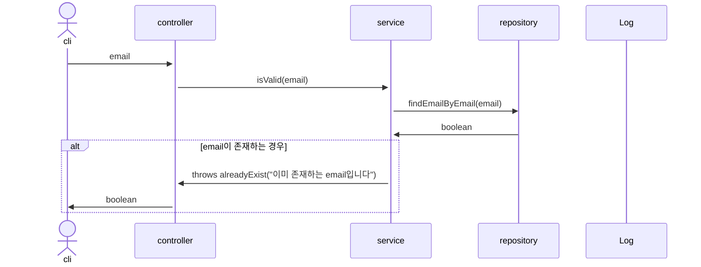

# isValidUserNickName

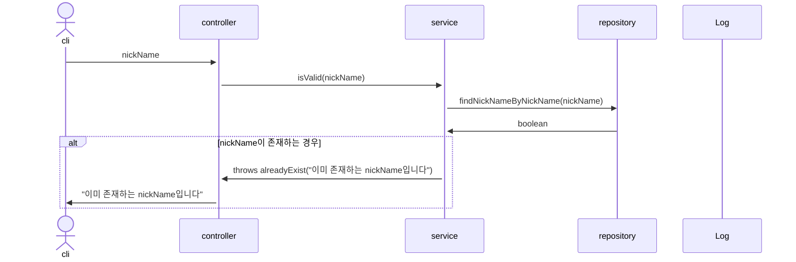

# 회원 등록

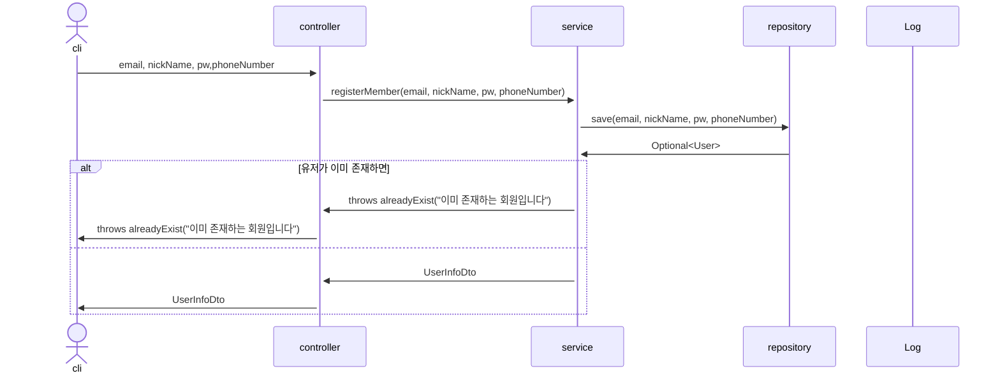

# deleteUser

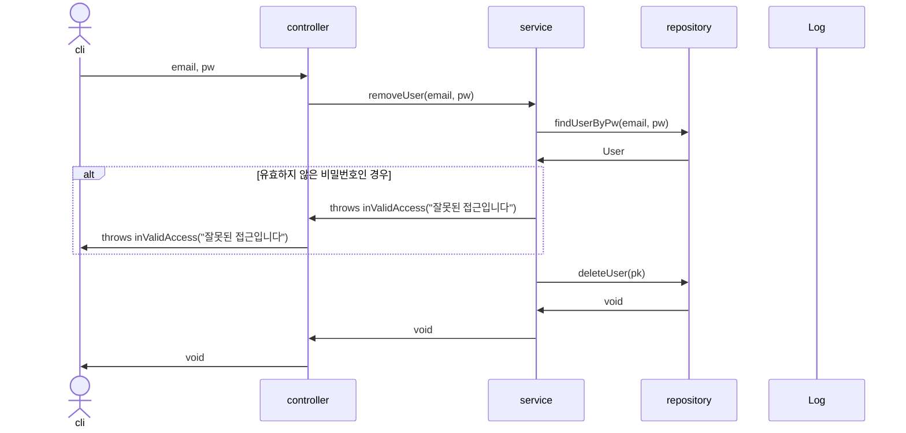

# modifyUser(보류)

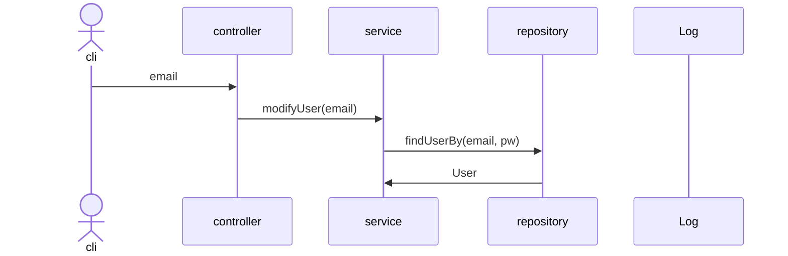

# modifyUserPw(보류)

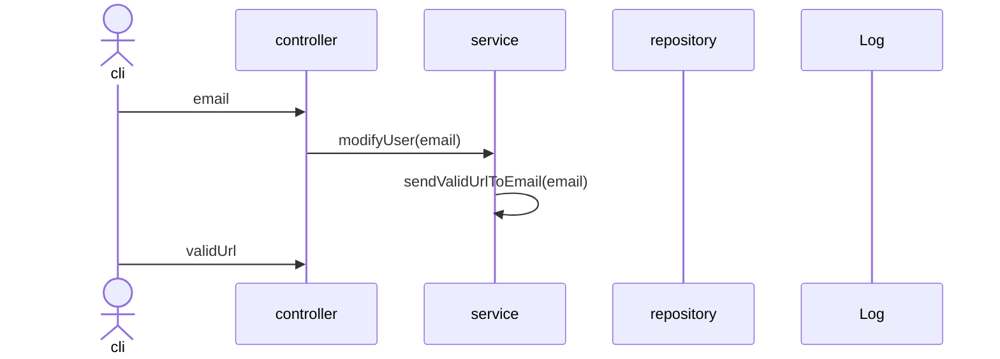

# login
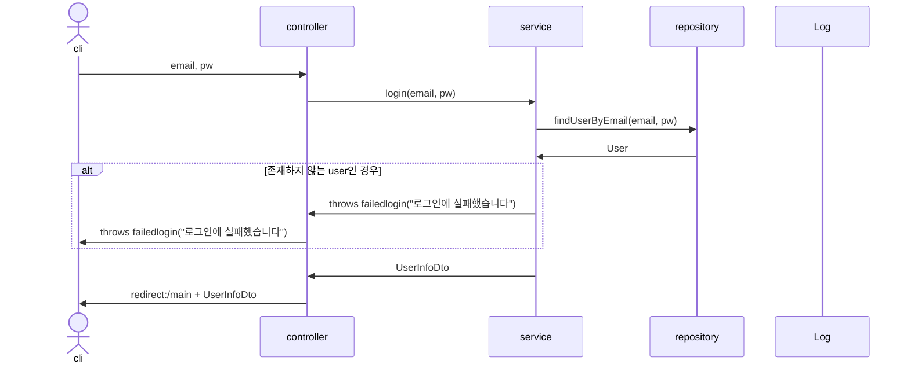

# logout(보류)
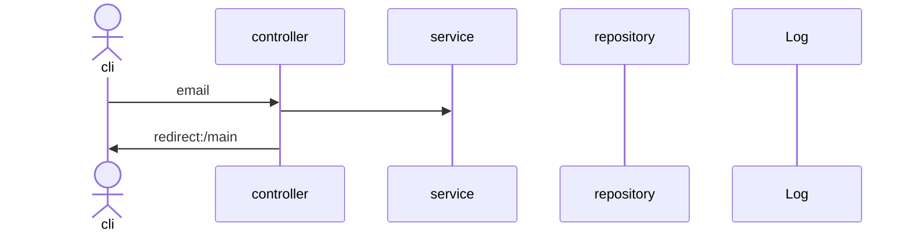

# searchUser
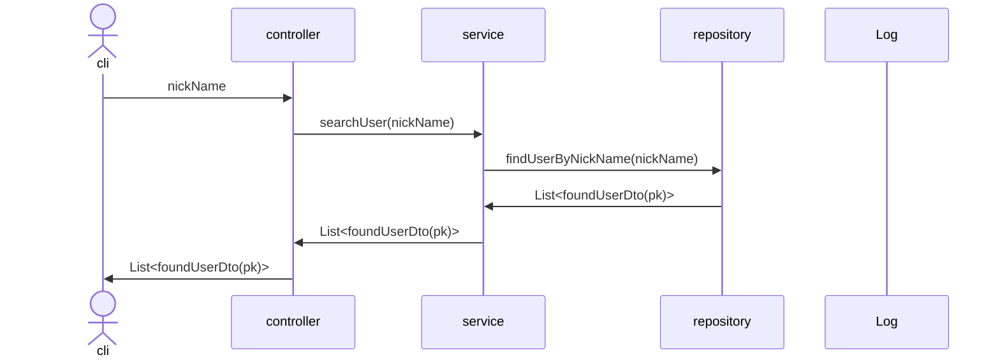

# searchLostUserId
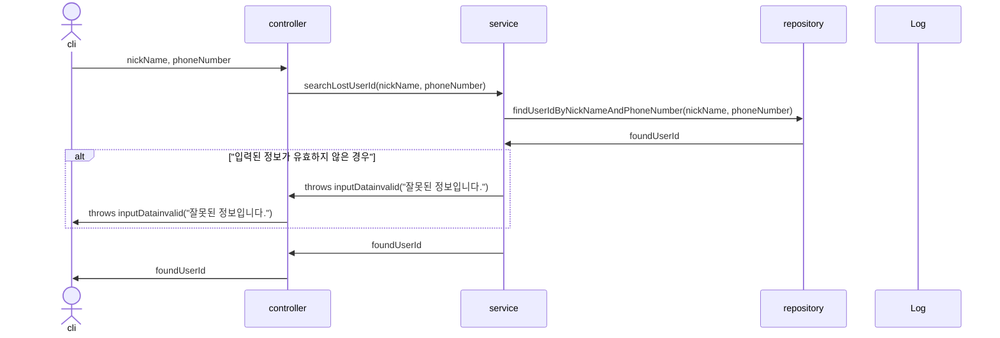

# searchLostUserPw(보류)
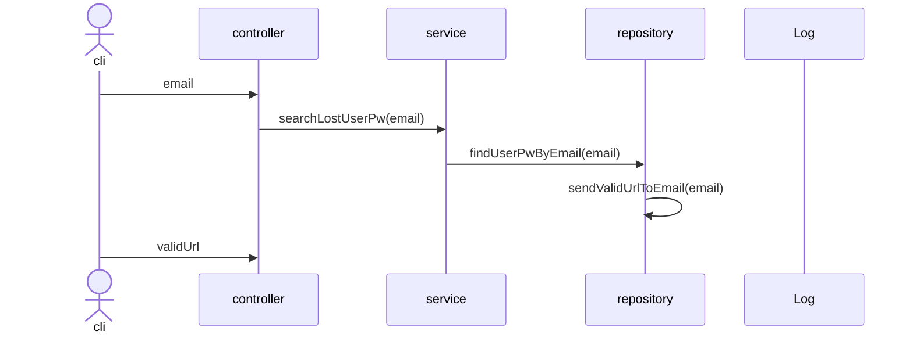

# searchUserPage
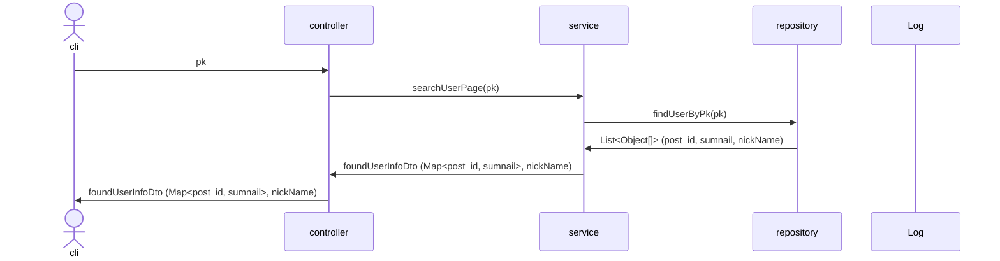


# modifyProfileImage(보류)
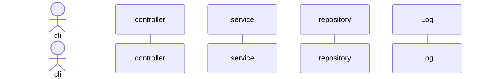


### savePost
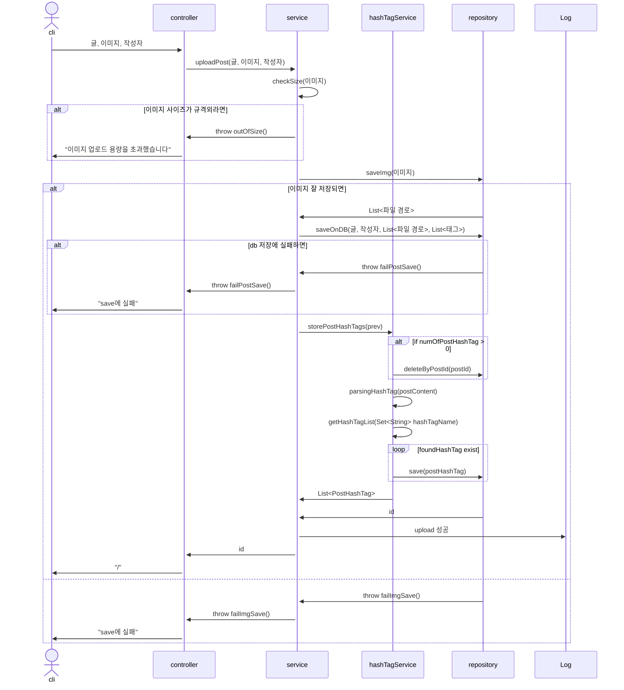

### delete post
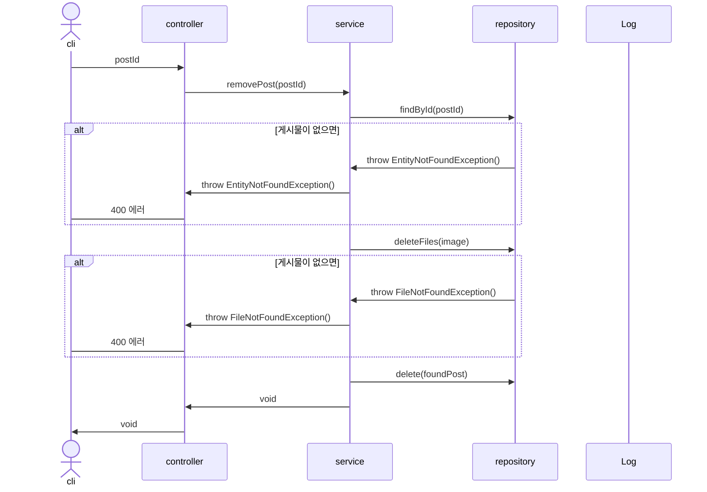

### updatePostForm

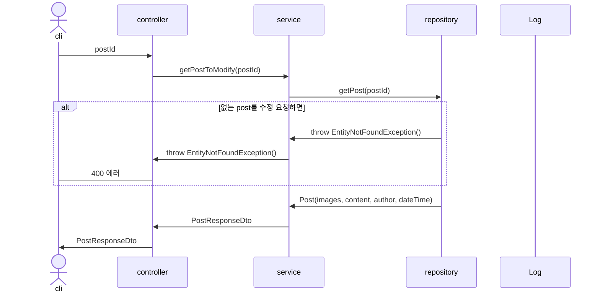

### updatePost

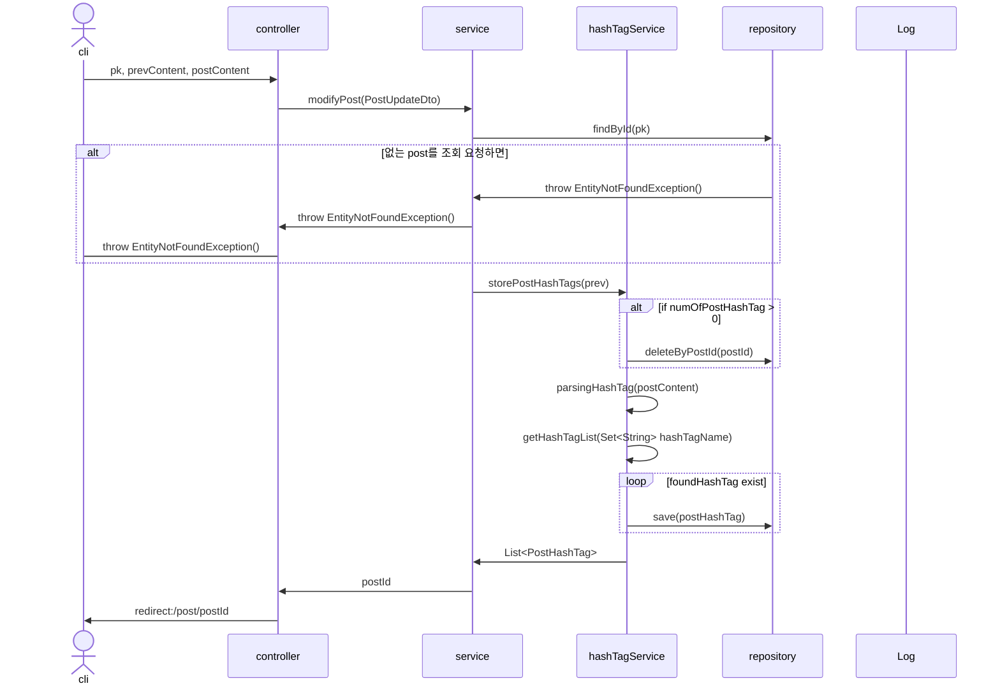

### Add Comment

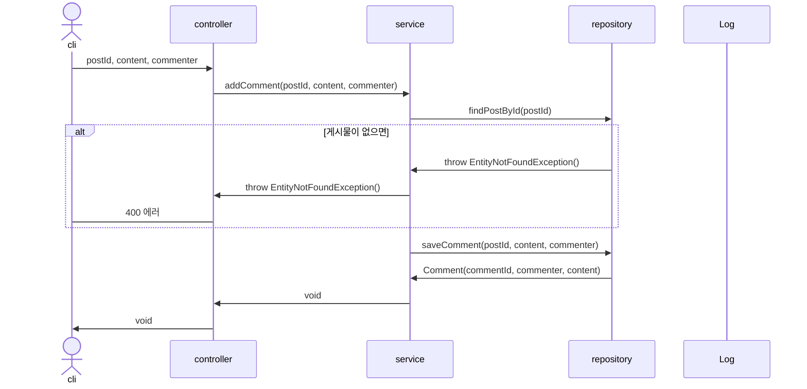

### Remove Comment

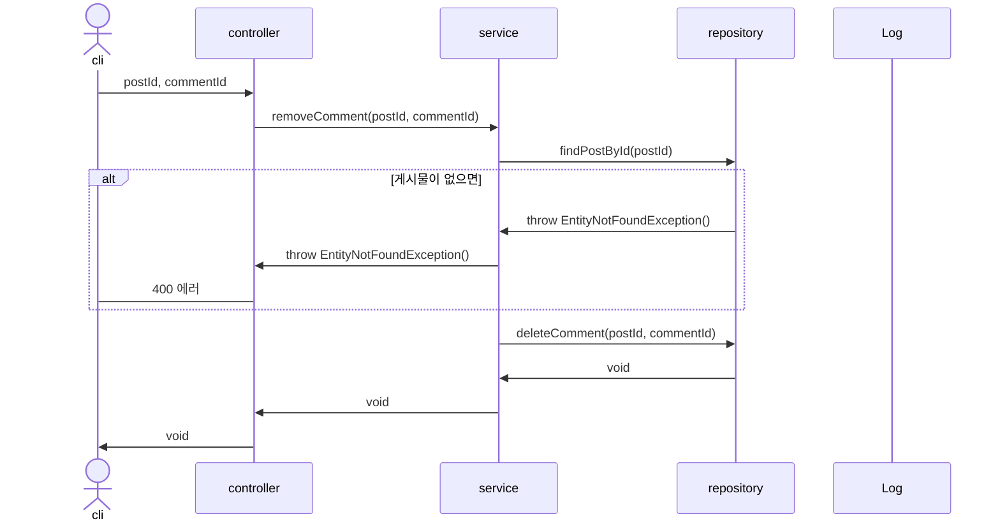

### searchByTag

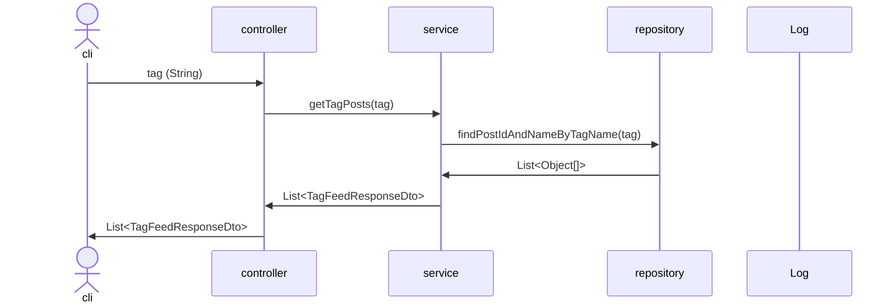


<!-- 부적절하다는 요청 -->
### hide post
```mermaid
sequenceDiagram
actor op
participant c as controller
participant s as service
participant r as repository
participant l as Log

op->>c: postId
c->>s: hidePost(postId)
s->>r: findById(postId)
r->>r: activePost(invisible)
r->>s: postId


```

### restore post
```mermaid
sequenceDiagram
actor op
participant c as controller
participant s as service
participant r as repository
participant l as Log

op->>c: postId
c->>s: hidePost(postId)
s->>r: findById(postId)
r->>r: changeStatus(invisible)
r->>s: postId


```


### showPostForm
```mermaid
sequenceDiagram
actor op
participant c as controller
participant s as service
participant r as repository
participant l as Log

op->>c: postId
c->>s: getPost(postId)
s->>c: postResponseDto
c->>op: PostResponseDto, List<Comment>, author
```

### showFeed
```mermaid
sequenceDiagram
actor cli
participant c as controller
participant s as service
participant r as repository
participant l as Log
# 매번 새로운 것을 보여줘야함
cli->>c: offset,limit
c->>s: showPosts(offset, limit)
s->>r: getPosts(pk, limit)
r->>s: List<Post>
s->>c: FeedResponseDto
c->>cli: FeedResponseDto
```

### showFeedForm
```mermaid
sequenceDiagram
actor cli
participant c as controller
participant s as service
participant r as repository
participant l as Log

cli->>c: void
c->>cli: void
```

### Remove Post

```mermaid
sequenceDiagram
actor cli
participant c as controller
participant s as service
participant r as repository
participant l as Log

cli->>c: pk
c->>s: removePost(pk)
s->>r: removePost(pk)
r->>r: findPostByIdInDB(pk)
r->>r: insertPostInTrashcan(Post)
alt 없는 post를 삭제 요청하면
r->>s: throw EntityNotFoundException()
s->>c: throw EntityNotFoundException()
c->cli: 400 에러
end
r->>s: void
s->>c: void
c->>cli: void
```
