# occupyMemberEmail

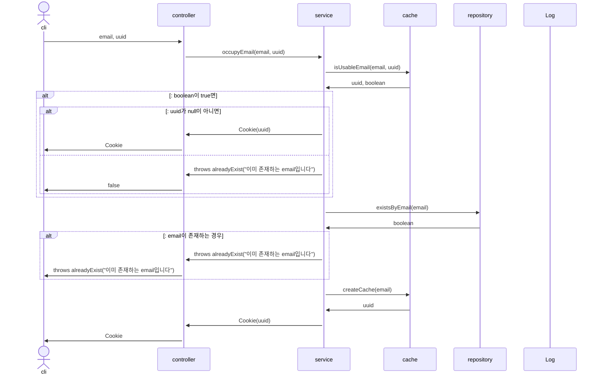

# occupyMemberNickName

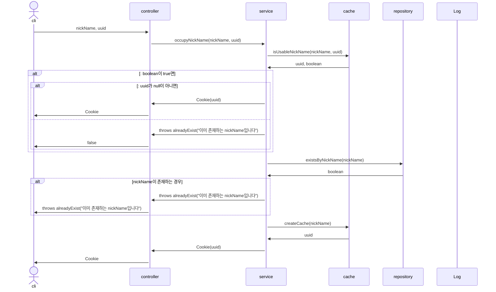

# memberSignupForm
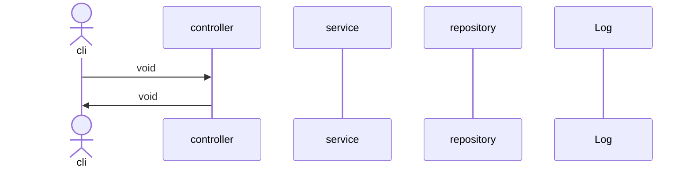

# memberSignup

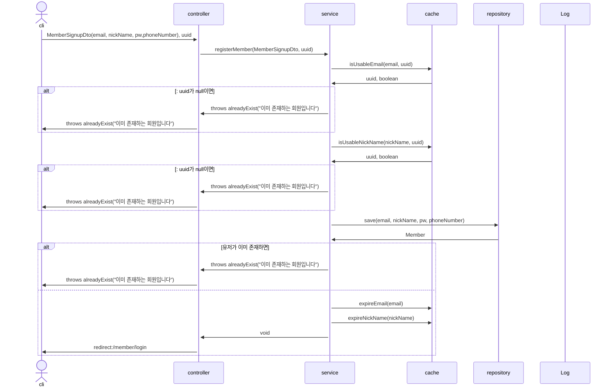

# deleteMember

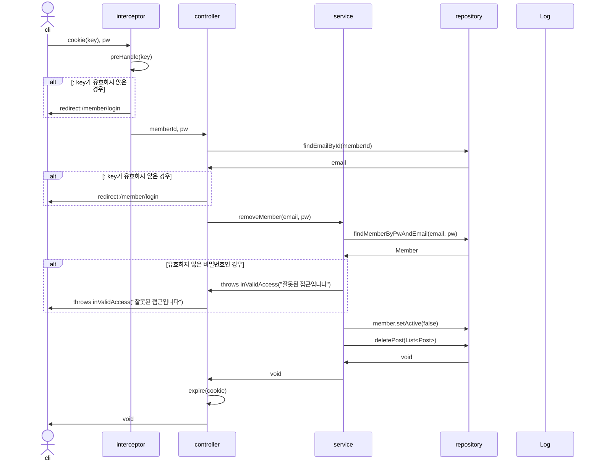

# settingMemberForm
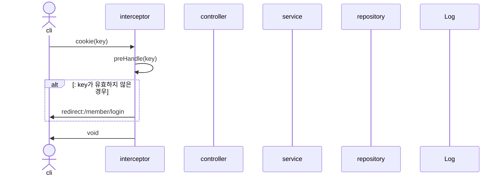

# isValidPwForm


# isValidPw
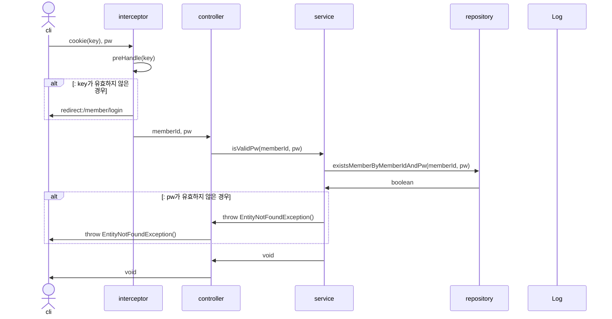

# modifyMemberForm
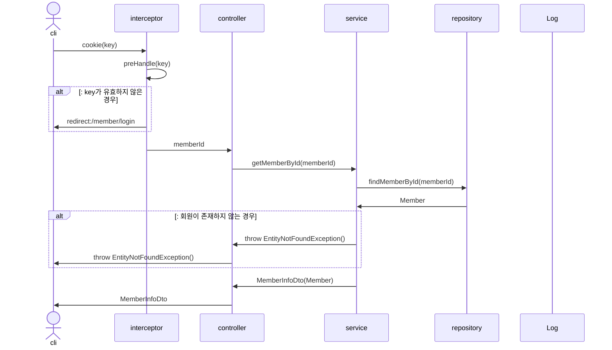

# modifyMember

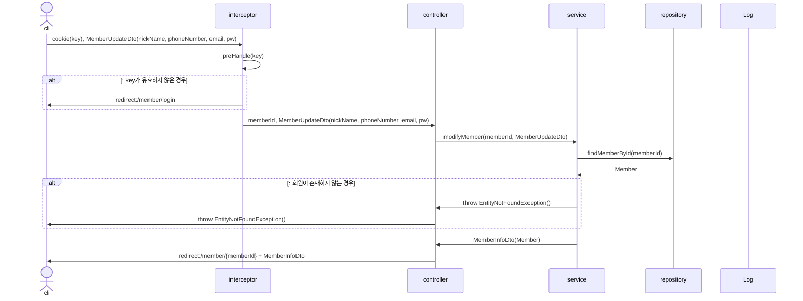

# login
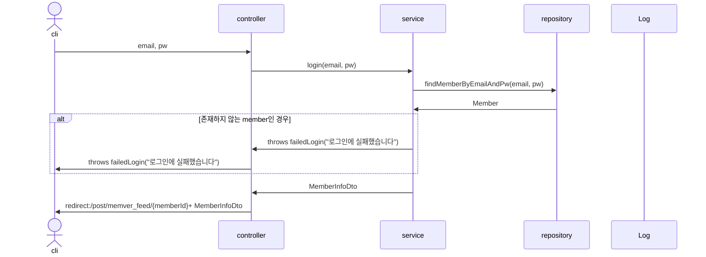

# logout
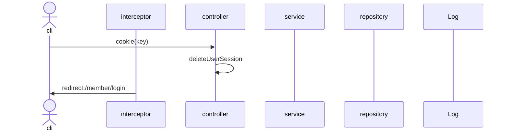

# searchLostMemberEmail
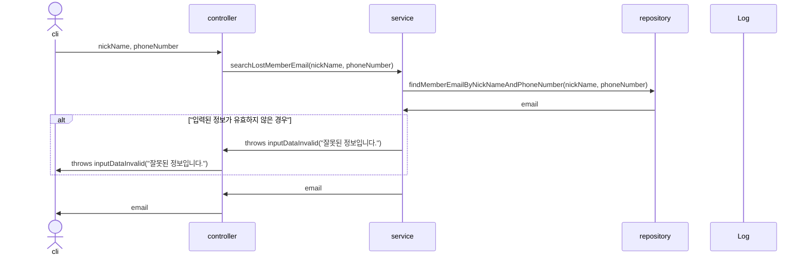

# searchLostMemberPw
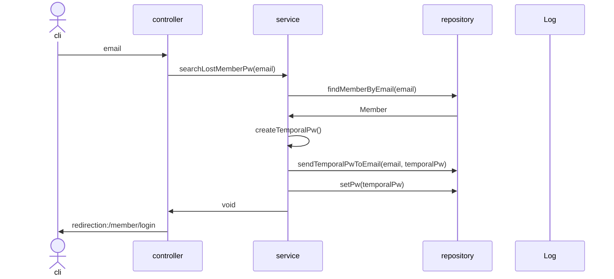

# searchMemberPageForm
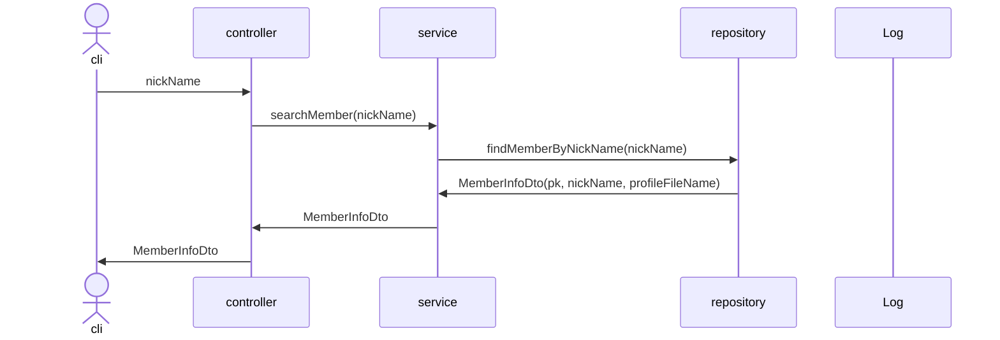

# searchMemberPage
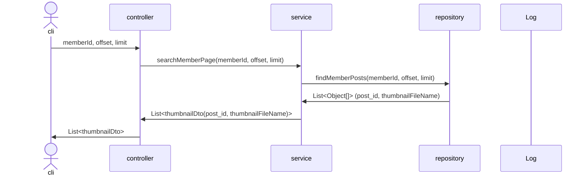

# savePost
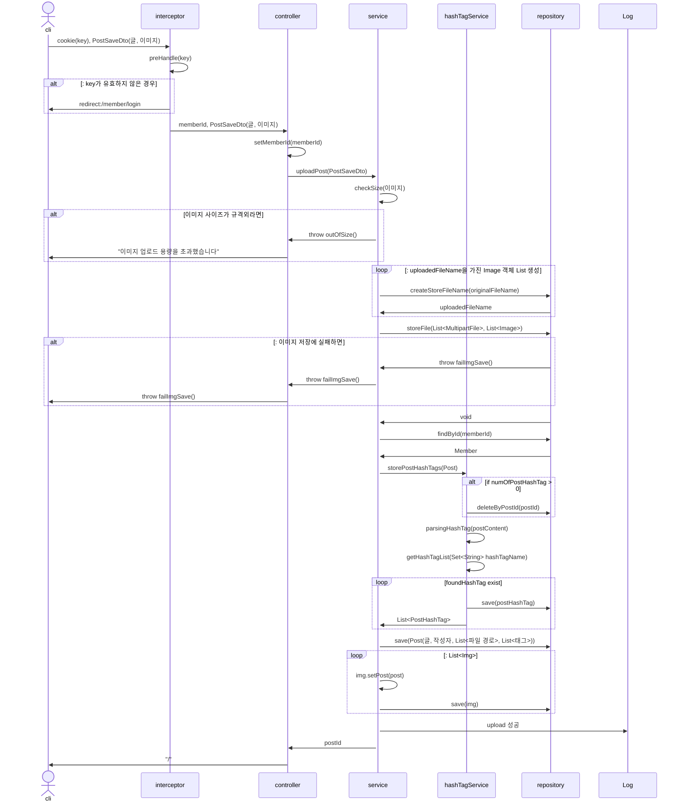

# delete post
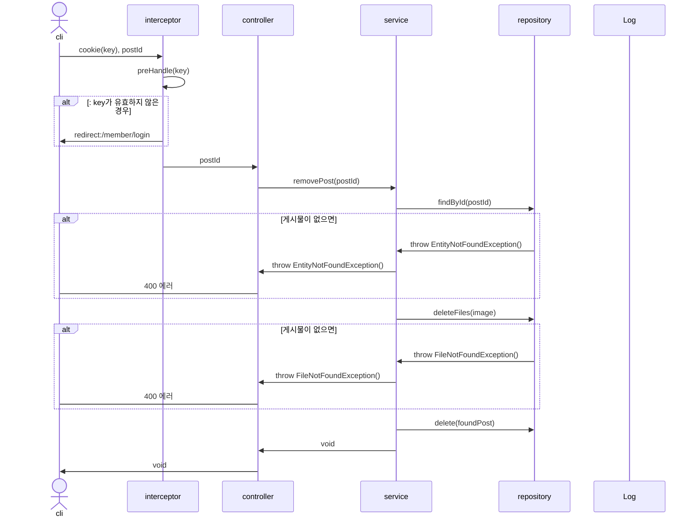

# updatePostForm

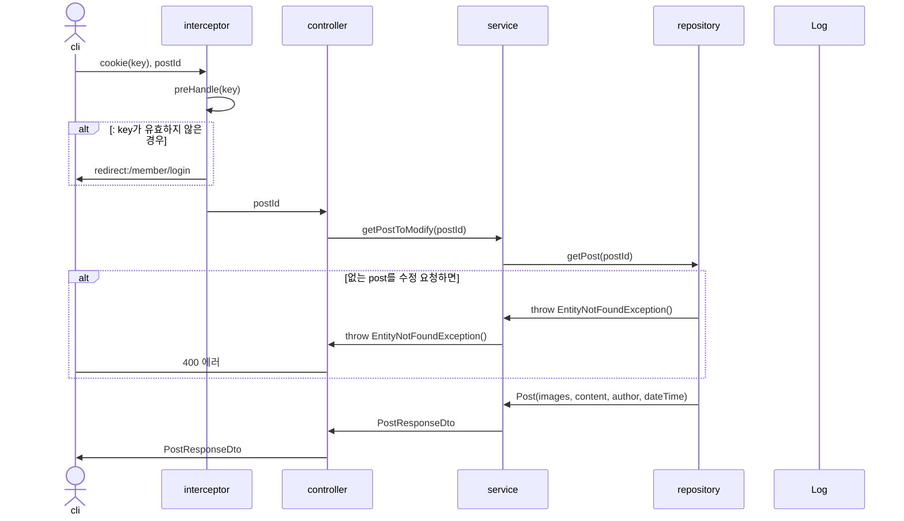

# updatePost

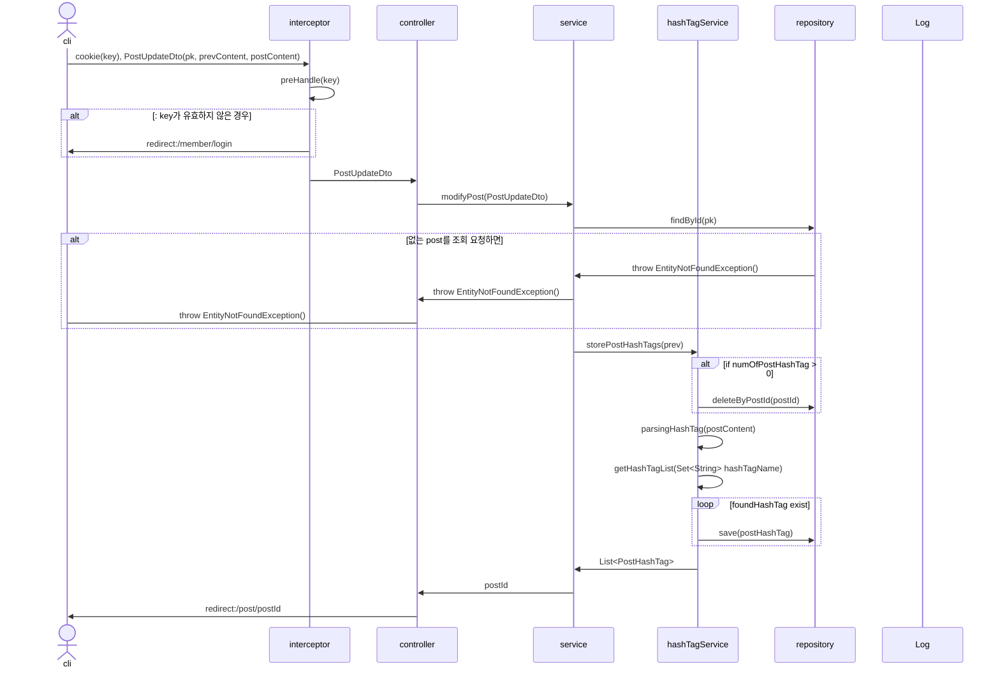

# Add Comment

```mermaid
sequenceDiagram
actor cli
participant i as interceptor
participant c as controller
participant s as service
participant r as repository
participant l as Log

cli->>i: cookie(key), postId, CommentRequestDto(content)
i->>i: preHandle(key)
alt: key가 유효하지 않은 경우
i->>cli: redirect:/member/login
end
i->>c: memberId, postId, CommentRequestDto
c->>s: addComment(postId, memberId, CommentRequestDto)
s->>r: findPostById(postId)
alt 게시물이 없으면
r->>s: throw EntityNotFoundException()
s->>c: throw EntityNotFoundException()
c->cli: 400 에러
end
r->>s: Post
s->>r: findMemberById(memberId)
alt 게시물이 없으면
r->>s: throw EntityNotFoundException()
s->>c: throw EntityNotFoundException()
c->cli: 400 에러
end
r->>s: Member
s->>r: save(Comment)
r->>s: void
s->>c: void
c->>cli: void
```

# Remove Comment

```mermaid
sequenceDiagram
actor cli
participant i as interceptor
participant c as controller
participant s as service
participant r as repository
participant l as Log

cli->>i: cookie(key), postId, commentId
i->>i: preHandle(key)
alt: key가 유효하지 않은 경우
i->>cli: redirect:/member/login
end
i->>c: postId, commentId
c->>s: removeComment(postId, commentId)
s->>r: findPostById(postId)
alt 게시물이 없으면
r->>s: throw EntityNotFoundException()
s->>c: throw EntityNotFoundException()
c->cli: 400 에러
end
s->>r: delete(commentId)
r->>s: void
s->>c: void
c->>cli: void
```

# searchByTagForm
```mermaid
sequenceDiagram
actor cli
participant c as controller
participant s as service
participant r as repository
participant l as Log

cli->>c: tagName
c->>s: getTagByTagName(tagName)
s->>r: findByName(tagName)
r->>s: HashTag
s->>c: TagResponseDto(HashTag)
c->>cli: TagResponseDto
```


# searchByTag

```mermaid
sequenceDiagram
actor cli
participant c as controller
participant s as service
participant r as repository
participant l as Log

cli->>c: tagId, offset, limit
c->>s: getTagPosts(tagId, offset, limit)
s->>r: findPostIdAndThumbnailFileNameByTagId(tagId, offset, limit)
r->>s: List<Object[]>
s->>c: List<ThumbnailDto(post_id, thumbnailFileName)>
c->>cli: List<ThumbnailDto>

```

# showPostForm
```mermaid
sequenceDiagram
actor op
participant c as controller
participant s as service
participant r as repository
participant l as Log

op->>c: postId
c->>s: getPost(postId)
s->>r: findById(postId)
r->>s: Post
s->>c: postResponseDto(Post's info)
c->>op: PostResponseDto
```

# showFeed
```mermaid
sequenceDiagram
actor cli
participant c as controller
participant s as service
participant r as repository
participant l as Log
# 매번 새로운 것을 보여줘야함
cli->>c: offset,limit
c->>s: showPosts(offset, limit)
s->>r: findPosts(pk, limit)
r->>s: List<Post>
s->>c: List<ThumbnailDto(postId, thumbnailFileName)>
c->>cli: List<ThumbnailDto>
```

# showFeedForm
```mermaid
sequenceDiagram
actor cli
participant c as controller
participant s as service
participant r as repository
participant l as Log

cli->>c: void
c->>cli: void
```

<!-- 부적절하다는 요청 -->
# hide post(보류)
```mermaid
sequenceDiagram
actor op
participant c as controller
participant s as service
participant r as repository
participant l as Log

op->>c: postId
c->>s: hidePost(postId)
s->>r: findById(postId)
r->>r: activePost(invisible)
r->>s: postId
```

# restore post(보류)
```mermaid
sequenceDiagram
actor op
participant c as controller
participant s as service
participant r as repository
participant l as Log

op->>c: postId
c->>s: hidePost(postId)
s->>r: findById(postId)
r->>r: changeStatus(invisible)
r->>s: postId
```

# Remove Post(backup 넣은 경우)

```mermaid
sequenceDiagram
actor cli
participant c as controller
participant s as service
participant r as repository
participant l as Log

cli->>c: cookie(key), postId
c->>r: existsCookieByKey(key)
r->>c: boolean
alt: key가 유효하지 않은 경우
c->>cli: redirect:/member/login
end
c->>s: removePost(postId)
s->>r: removePost(postId)
r->>r: findPostByIdInDB(postId)
r->>r: insertPostInTrashcan(Post)
alt 없는 post를 삭제 요청하면
r->>s: throw EntityNotFoundException()
s->>c: throw EntityNotFoundException()
c->cli: 400 에러
end
r->>s: void
s->>c: void
c->>cli: void
```