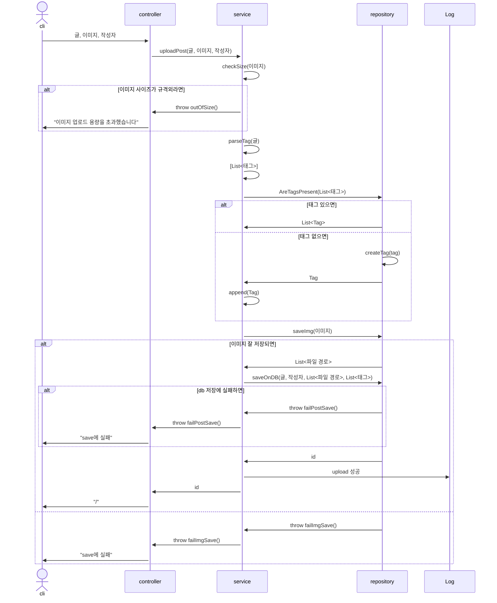
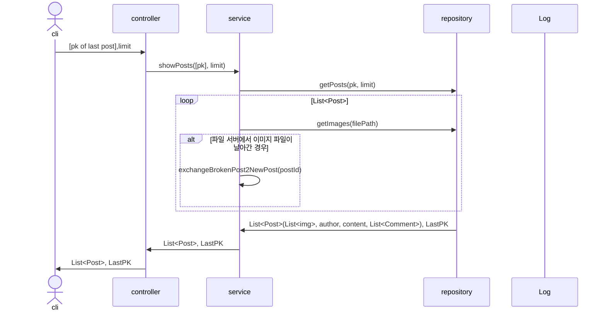
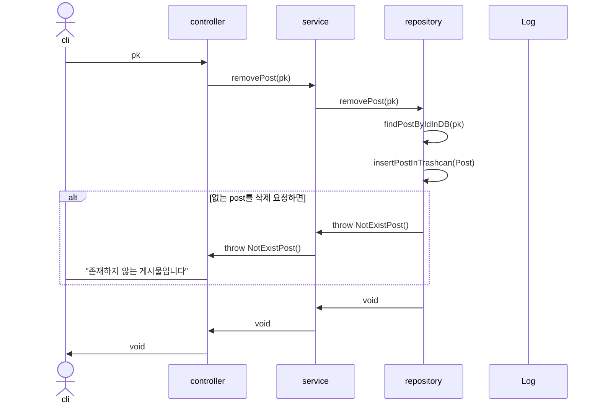
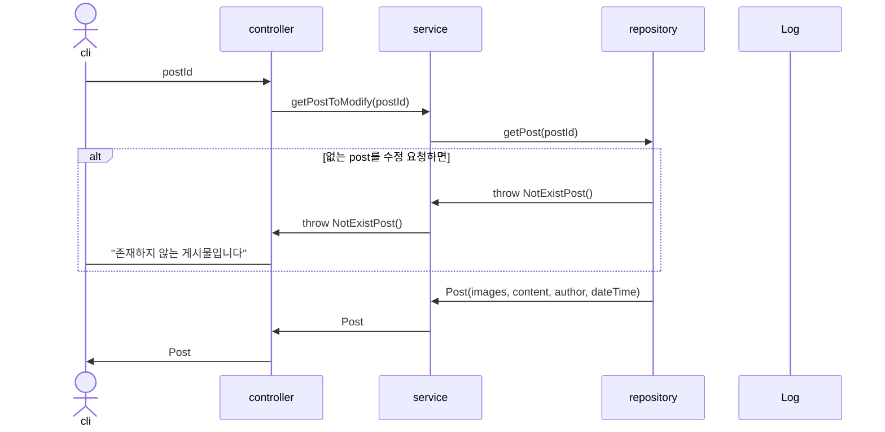
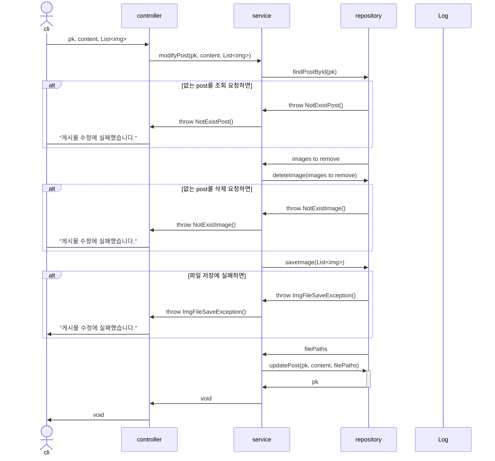
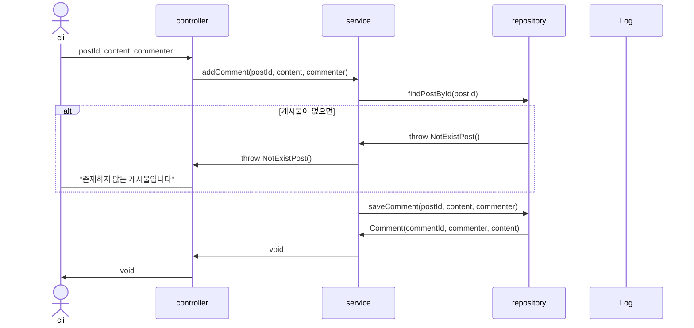
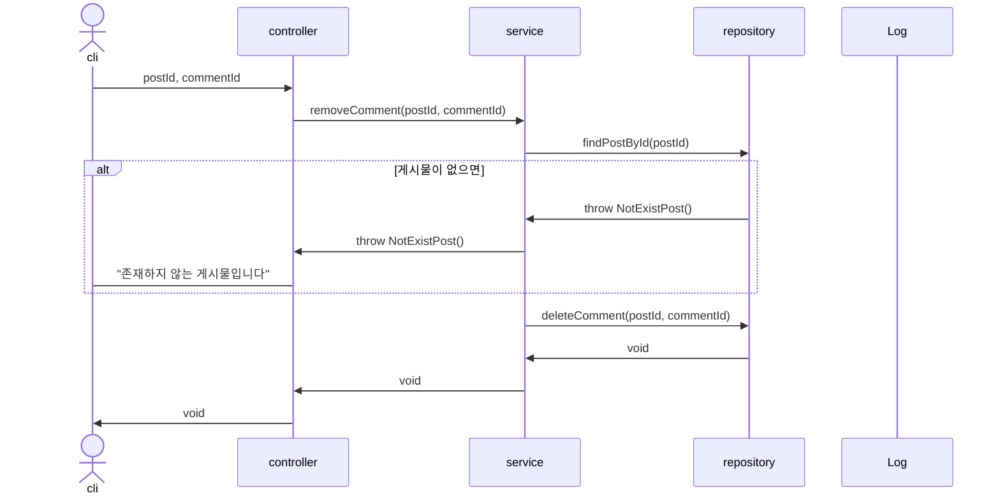
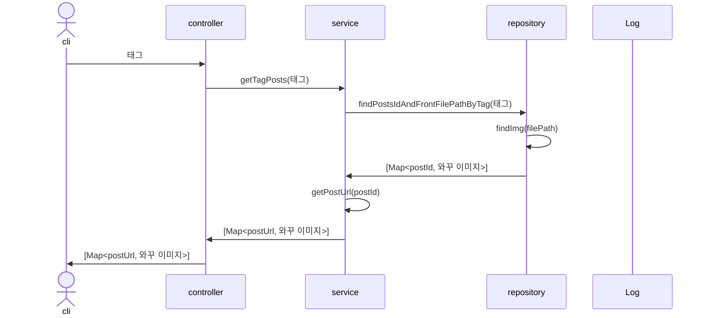
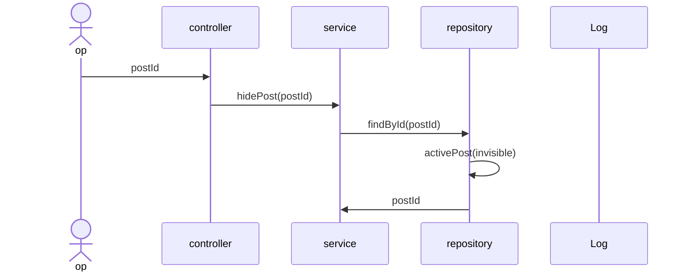

### Upload Post

### Show Posts

### Remove Post

### Get Post

### Modify Post

### Add Comment

### Remove Comment

### search by Tag

<!-- 부적절하다는 요청 -->
### hide post

### restore post

### delete post