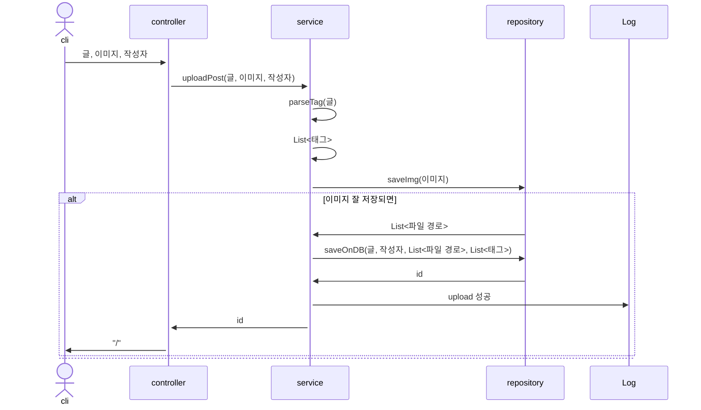
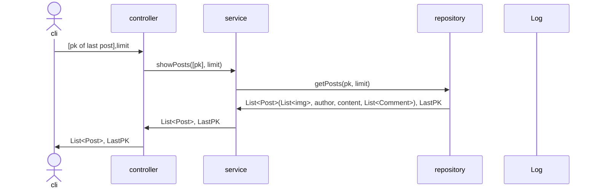
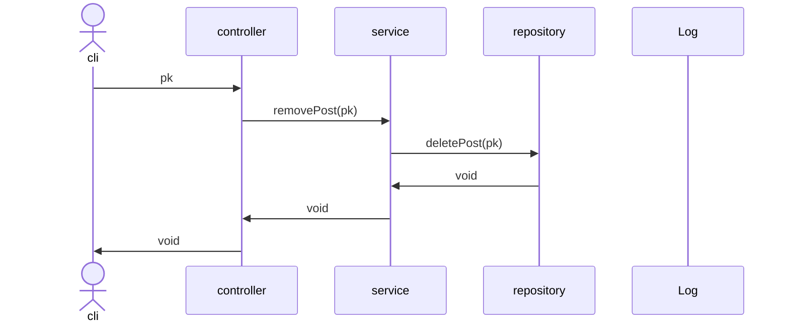
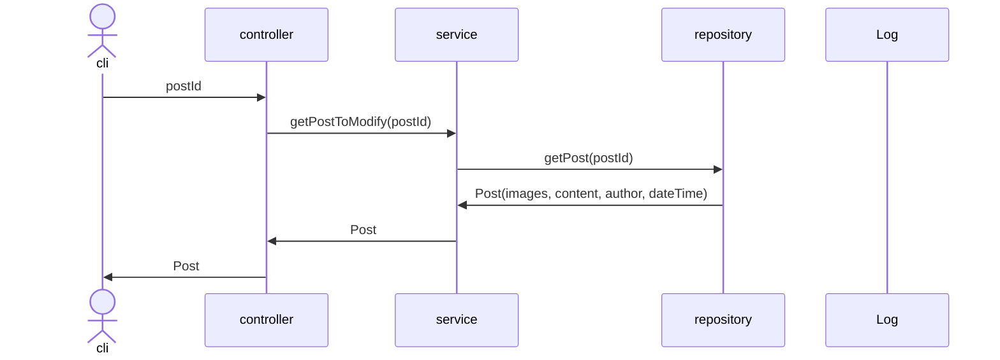
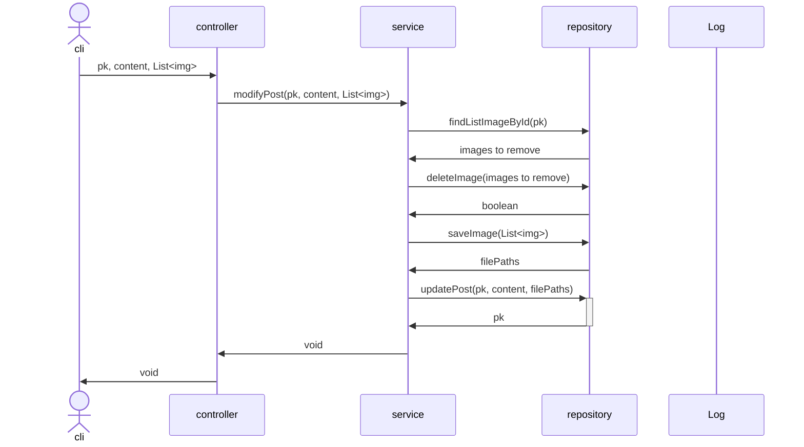
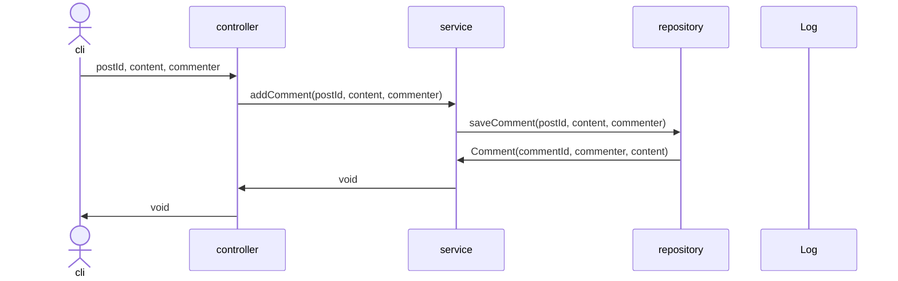
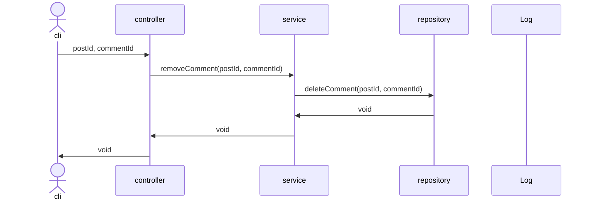

### Upload Post

```mermaid
sequenceDiagram
actor cli
participant c as controller
participant s as service
participant r as repository
participant l as Log

cli->>+c: 글, 이미지, 작성자
c->>+s: uploadPost(글, 이미지, 작성자)
s->>s: parseTag(글)
s->>s: List<태그>
s->>r: saveImg(이미지)
alt 이미지 잘 저장되면
r->>s: List<파일 경로>
s->>r: saveOnDB(글, 작성자, List<파일 경로>, List<태그>)
r->>s: id
s->>l: upload 성공
s->>c: id
c->>cli: "/" 
else
end
```

### Show Post

```mermaid
sequenceDiagram
actor cli
participant c as controller
participant s as service
participant r as repository
participant l as Log
# 매번 새로운 것을 보여줘야함
cli->>c: [pk of last post],limit
c->>s: showPosts([pk], limit)
# s->>s: 
s->>r: getPosts(pk, limit)
r->>s: List<Post>(List<img>, author, content, List<Comment>), LastPK
s->>c: List<Post>, LastPK
c->>cli: List<Post>, LastPK
```

### Remove Post

```mermaid
sequenceDiagram
actor cli
participant c as controller
participant s as service
participant r as repository
participant l as Log

cli->>c: pk
c->>s: removePost(pk)
s->>r: deletePost(pk)
r->>s: void
s->>c: void
c->>cli: void
```

### Get Post

```mermaid
sequenceDiagram
actor cli
participant c as controller
participant s as service
participant r as repository
participant l as Log

cli->>c: postId
c->>s: getPostToModify(postId)
s->>r: getPost(postId)
r->>s: Post(images, content, author, dateTime)
s->>c: Post
c->>cli: Post
```

### Modify Post

```mermaid
sequenceDiagram
actor cli
participant c as controller
participant s as service
participant r as repository
participant l as Log

cli->>c: pk, content, List<img>
c->>s: modifyPost(pk, content, List<img>)
s->>r: findListImageById(pk)
r->>s: images to remove
s->>r: deleteImage(images to remove)
r->>s: boolean
s->>r: saveImage(List<img>)
r->>s: filePaths
s->>+r: updatePost(pk, content, filePaths)
r->>-s: pk
s->>c: void
c->>cli: void
```

### Add Comment

```mermaid
sequenceDiagram
actor cli
participant c as controller
participant s as service
participant r as repository
participant l as Log

cli->>c: postId, content, commenter
c->>s: addComment(postId, content, commenter)
s->>r: saveComment(postId, content, commenter)
r->>s: Comment(commentId, commenter, content)
s->>c: void
c->>cli: void
```

### Remove Comment

```mermaid
sequenceDiagram
actor cli
participant c as controller
participant s as service
participant r as repository
participant l as Log

cli->>c: postId, commentId
c->>s: removeComment(postId, commentId)
s->>r: deleteComment(postId, commentId)
r->>s: void
s->>c: void
c->>cli: void
```